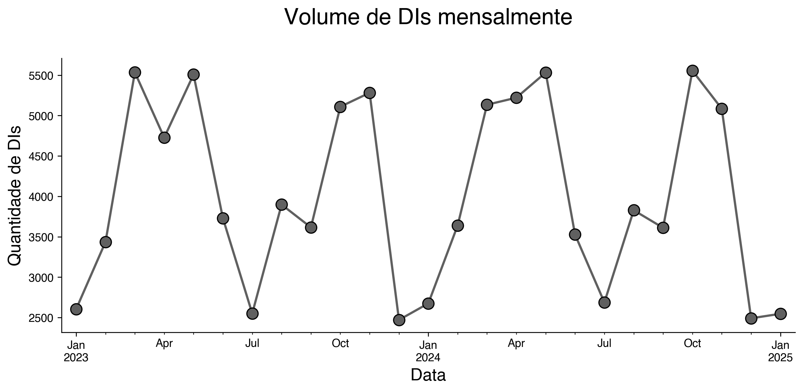
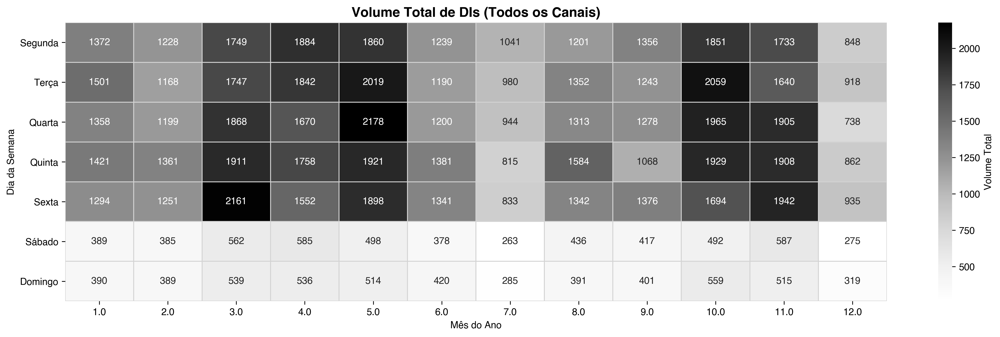

# Relatório Técnico: Previsão de Canal Aduaneiro

Solução desenvolvida para prever o nível (canal) de fiscalização aplicado a uma Declaração de Importação (DI). 

## Perguntas Específicas

### Análise de Negócio

1. Quais são os 5 NCMs com maior risco de canal vermelho?

Para cada NCM, calculei a distribuição nos 4 canais. Por exemplo, para o ncm_code 22071000 a distribuição é verde (96.031523), vermelho (3.236701), amarelo (0.647340) e cinza (0.084436). Fiz dessa maneira para reduzir o viés de volume.

Com base na taxa de incidência histórica:

    38220090 (3.99%): Produtos de indústrias químicas.
    22072000 (3.58%): Álcool etílico/Aguardentes.
    22071000 (3.24%): Álcool não desnaturado.
    85444200 (2.62%): Fios e cabos elétricos.
    40169990 (2.37%): Obras de borracha.

2. Existe sazonalidade na distribuição dos canais?

Sim. O volume de DIs oscila bruscamente com picos em torno de abril e também de outubro. Por outro lado, vemos uma redução significativa nos meses de julho e janeiro.

Outra informação relevante é a redução nos finais de semana:

3. Qual o impacto do modo de transporte na seleção do canal? Justifique com dados.

Aéreo possui maior taxa de canal vermelho (2.44%), seguido de meios próprios (2.17%). Curiosamente, entrada/saída fictícia não possui nenhum registro de canal vermelho.

    Taxa de incidência (%) de cada canal por Modal de Transporte:
    channel                 VERDE  AMARELO  VERMELHO  CINZA
    transport_mode_pt                                      
    AEREA                   96.59     0.92      2.44   0.05
    ENTRADA/SAÍDA FICTÍCIA  97.50     2.50      0.00   0.00
    FERROVIARIA             98.88     0.00      1.12   0.00
    MARITIMA                97.35     0.82      1.79   0.04
    MEIOS PRÓPRIOS          97.83     0.00      2.17   0.00
    POSTAL                  97.11     0.85      2.04   0.00
    RODOVIARIA              97.29     1.08      1.58   0.05

4. Como o porte da empresa influencia o canal?

Difícil dizer porque mais de 95% das empresas nesse dataset são da classe DEMAIS. Porém, considerando as informações disponíveis, empresas menores (micro e pequeno porte) possuem maior incidência de canal vermelho. Mas é necessário um estudo mais aprofundado para validar esse resultado.

                               VERDE  AMARELO  VERMELHO  CINZA
    consignee_company_size                                   
    MICRO EMPRESA              95.7      1.3       2.8    0.2
    EMPRESA DE PEQUENO PORTE   96.1      1.1       2.8    0.0
    DEMAIS                     97.1      0.9       2.0    0.0

### Modelagem

Separei os dados entre treino (2023-01-01 → 2024-10-31 (22 meses)) e teste (2024-11-01 → 2025-01-31 (3 meses))

Para extrair mais informações dos dados, criei features como ano, mes, dia_semana e trimestre). Além disso, criei features de agregação histórica (lag features) calculadas exclusivamente no conjunto de treino: `taxa_risco_pais`, `taxa_risco_ncm`, `taxa_risco_ncm_code`, `taxa_risco_clearance_entry`, `taxa_risco_clearance_dispatch`, `taxa_risco_clearance_place` e `volume_dis_pais`. Cada uma codifica a proporção histórica de DIs em canais de risco (Vermelho, Amarelo ou Cinza) para uma dada categoria, funcionando como um target encoding seguro contra leakage temporal. Valores não vistos no treino recebem fallback na taxa global de risco (o fallback é a taxa global de risco do treino, impedindo data leakage).

Busquei insumos adicionais pesquisando pelo NCM na internet e criei a feature `ncm_grau_elaboracao`, que extrai os dois primeiros dígitos do código NCM — o Capítulo do produto na Nomenclatura Comum do Mercosul. Esses capítulos refletem o grau de elaboração industrial da mercadoria: capítulos mais baixos correspondem a matérias-primas (animais vivos, produtos agrícolas), enquanto capítulos mais altos correspondem a produtos manufaturados (máquinas, veículos, eletrônicos). 

Outra tranformação foi a criação de variáveis a partir do tipo do consignee e shipper (usei regex para ver se o nome contém INTERNATIONAL, TRADING, COMERCIAL, ETC...). E fiz algo semelhante para os tipos de clearance (mas aqui é se é PORTO ou AEROPORTO). 

5. Qual modelo apresentou melhor desempenho?

Além do baseline (modelo dummy prevendo sempre o canal verde), testei três modelos: RandomForest, HistGradientBoosting e XGBoost. Os três possuem dificuldade em prever as classes. No geral, o melhor foi Random Forest com class_weight='balanced' e oversampling entregando recall de 29% para classe vermelha e de 72% para a classe verde, mas com baixo f1-score para as classes diferentes de verde. 

O XGBoost alcançou 95% de acurácia global mas foi porque colapsou a previsão para a classe majoritária (Verde), tendo apenas 3% de recall no Vermelho. 

Resumindo, o modelo que apresentou o melhor desempenho foi o Random Forest, com um recall de 72% para a classe verde e 29% para a classe vermelha.

6. Como lidou com o desbalanceamento?

Oversampling: Aplicação de RandomOverSampler no pipeline de treino para equalizar as classes antes do treinamento.

Parâmetro class_weight='balanced' na Random Forest para penalizar erros nas classes minoritárias proporcionalmente à sua raridade.

Ambas as técnicas atuam em conjunto. O oversampling reequilibra a distribuição de treino, enquanto o class_weight ajusta a função de perda internamente.

7. Quais features são mais importantes?

Para este trabalho, decidi trazer (além do básico feature importance da RandomForest) uma técnica diferente para calcular a importância das features: Permutation Feature Importance. Ela funciona basicamente fazendo um shuffle em uma feature por vez antes de aplicar o modelo. Quanto mais importante for a feature, mais esse shuffle vai afetar a performance do modelo.

Considerando tanto Gini Importance (específica da árvore) e Permutation Feature Importance, temos variáveis importantes as taxas de risco, como: `taxa_risco_pais`, `taxa_risco_ncm_code`, `taxa_risco_clearance_place`, `taxa_risco_clearance_entry`. Variáveis de `Sazonalidade`: (ano, mes, trimestre). Tipo de transporte: `transport_mode_pt`. E variáveis sobre o ncm: `ncm_grau_elaboracao` e `ncm_code`. Veja figuras `eval_plots/feature_importance_gini.png` e `eval_plots/permutation_importance.png`  

8. Como garantir robustez sazonal?

Via features temporais derivadas extraídas diretamente da data de registro, além de monitoramento contínuo.

## Produção & Limitações

9. Monitoramento

Via métricas como o PSI (population stability index). Implementação de dashboards para Data Drift (mudança no perfil de importação, ex: novos países de origem) e Concept Drift (monitoramento semanal do Recall do canal Vermelho vs. realidade). Seria interessante acompanhar mensalmente o numero de casos por canal, porque uma variação pode afetar o modelo. Introduzir alertas automáticos quando a distribuição de features ou a performance do modelo desviar significativamente da baseline.

10. Retreinamento

Estratégia híbrida: Retreino mensal (agendado) com janela deslizante de dados e retreino via trigger (automático) caso a performance caia abaixo de 20% de Recall no Vermelho. Os lookup tables de agregação histórica (lag_lookups.pkl) devem ser recalculados a cada retreino.

11. Riscos de Bias

O principal risco são categorias novas não possuirem histórico. Para resolver isso, é possível implementar um período de quarentena para (por exemplo) novos importadores com score neutro (fallback global) até acumular N operações.

# Diagnóstico: Por que a performance é limitada

Os três modelos testados, apesar de arquiteturas distintas, convergem para um teto de performance baixo nas classes minoritárias. Isso é evidência de que as variáveis disponíveis no dataset não carregam sinal discriminativo suficiente para a tarefa. Outras variáveis (como o valor da mercadoria, por exemplo) poderiam ser integradas a fim de melhorar a performance do modelo

O Cramér's V confirma que as variáveis categóricas brutas possuem associação negligível com o canal (veja figura `EDA_figs/cramers_v_heatmap.png`). Isso justifica a incorporação de novas features e mais dados para tratar o problema.

Além disso, a Permutation Importance mostrou valores de baixa magnitude (entre -0.001 e 0.012) para todas as features, indicando que cada atributo contribui marginalmente para o recall das classes minoritárias, sem nenhuma feature forte o suficiente para separar as classes com confiança.

Adicionalmente, a performance poderia ser incrementada com cross-validation temporal (e.g., TimeSeriesSplit) e hyperparameter tuning via GridSearch ou Optuna, que não foram explorados neste escopo devido à restrição de tempo. 

O desbalanceamento extremo (97% Verde) combinado com features de baixa discriminação cria um cenário onde o modelo não tem informação suficiente para separar as classes.

Em versões anteriores da solução, tentei transformar o problema em previsão binária: VERDE vs NÃO VERDE, mas mesmo assim as previsões estavam longe de ótimas. Ao que tudo indica ( matriz Cramers), as variáveis preditoras não explicam muito bem a variável resposta desse problema.